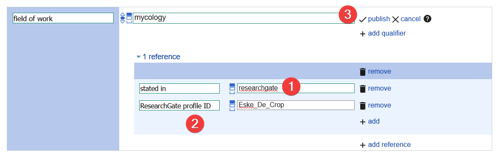

# A quick guide on how to add persons to Wikidata

## Table of Contents

- [A quick guide on how to add persons to Wikidata](#a-quick-guide-on-how-to-add-persons-to-wikidata)
  - [Table of Contents](#table-of-contents)
  - [About statements](#about-statements)
    - [Adding a statement](#adding-a-statement)
    - [Adding a reference to a statement](#adding-a-reference-to-a-statement)
    - [Adding Identifiers](#adding-identifiers)
  - [Suggestions flag](#suggestions-flag)
  - [Some examples](#some-examples)

Welcome to Wikidata! 

Objects on wikidata have a label, a wikidata id, and a description, and optionally one or more aliases. The wikidata id is the unique identifier, and remains constant. All other values can change. The label is the name shown at the top of the page, and is useful for users to know what the object is describing. For a person for example, this would be their name. The description is one line to elaborate on this, I like to stick to what the person is most known for, for example: “Belgian Botanist”. The alias is used for alternative labels, abbreviations, or other names the person might be known under. 

Creating a new item is easy, just click the button on the right of the page.

This will take you to a page where you can enter the label, the description and Aliases of the object you are creating.

If you change your mind or if you would like to add something you can still change these values after creating the page, for example to add values for another language. 

Remember to click the publish button after every change you make. If the button is greyed out, this means you either didn’t change anything or you are trying to breaking some sort of rule (like using free text in a property field). Don’t hesitate to ask for help if you get stuck!

## About statements
Statements about an object follow a triple structure, this means that they have 3 parts:

    Object : Property : Value

Or in our case:

    Eske De Crop : (is an) Instance of : (a) human

“Instance of” and “human” are also wikidata items, which also have statements, and this way everything is connected on wikidata! 
#Adding a statement

### Adding a statement

To add a statement first hit the ‘add statement’ button, then type your property to the left (instance of) and type your value in the middle (human), hit publish if you are ready. 

### Adding a reference to a statement

When creating a statement, you can add a reference at the same time, or you can do it afterwards. Just hit the “add reference” button. For some statements it’s very difficult/a bit silly to find a reference, but that doesn’t mean they are less valuable to add.. Examples are first and surname, gender and instance of human.

References follow the same sort of triple structure as statements (because they are statements), for a website use the “reference url” property. When referring to a website I like to add the date as well, so I use “retrieved”. You can add more values for a reference using the add button, for a book for example you might want to add ISBN, Page, Author, Title, …

You can also refer to a database as a reference, for example, researchgate or ORCID might give you information about birth dates, occupation, interests, … In this case I use the “stated in” property for the database, and use the database property (here it’s ResearchGate profile ID, but just type the database name in the property field and I’ll suggest some values for you) and the database identifier in the value field.

Don’t forget to hit publish when you are done.

### Adding Identifiers

Identifiers are regular statements, and we can add references for them just like for any other statement.

## Suggestions flag

Some statements have mandatory parts, for example, when I use the ‘described at URL’ property, wikidata expects me to add the language of the website I’m referring to:

You might run into this when adding a place of birth or death. As a reference is mandatory for these statements. Wikidata will let you add them without a reference, but a little flag will appear next to the value.

## Some examples

Need some inspiration? Have a look at the page I made for this guide: 

[Eske De Crop](https://www.wikidata.org/wiki/Q88449437)

Or some other pages of botanical collectors with many statements:

[Quentin Groom](https://www.wikidata.org/wiki/Q28913658)

[Henri Ferdinand Van Heurck](https://www.wikidata.org/wiki/Q5894416)

[François Crépin](https://www.wikidata.org/wiki/Q1450997)

You can also find a lot of information about how to use Wikidata on wikidata itself, have a look at the [tours](https://en.wikipedia.org/wiki/Help:Referencing_for_beginners), or [this page](https://en.wikipedia.org/wiki/Help:Referencing_for_beginners) about referencing.

